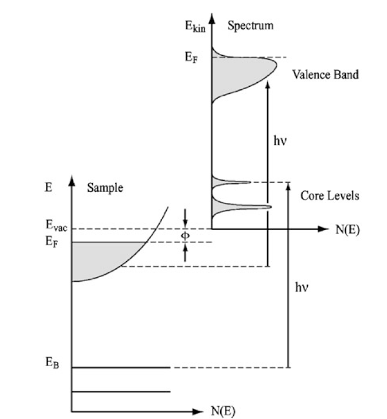
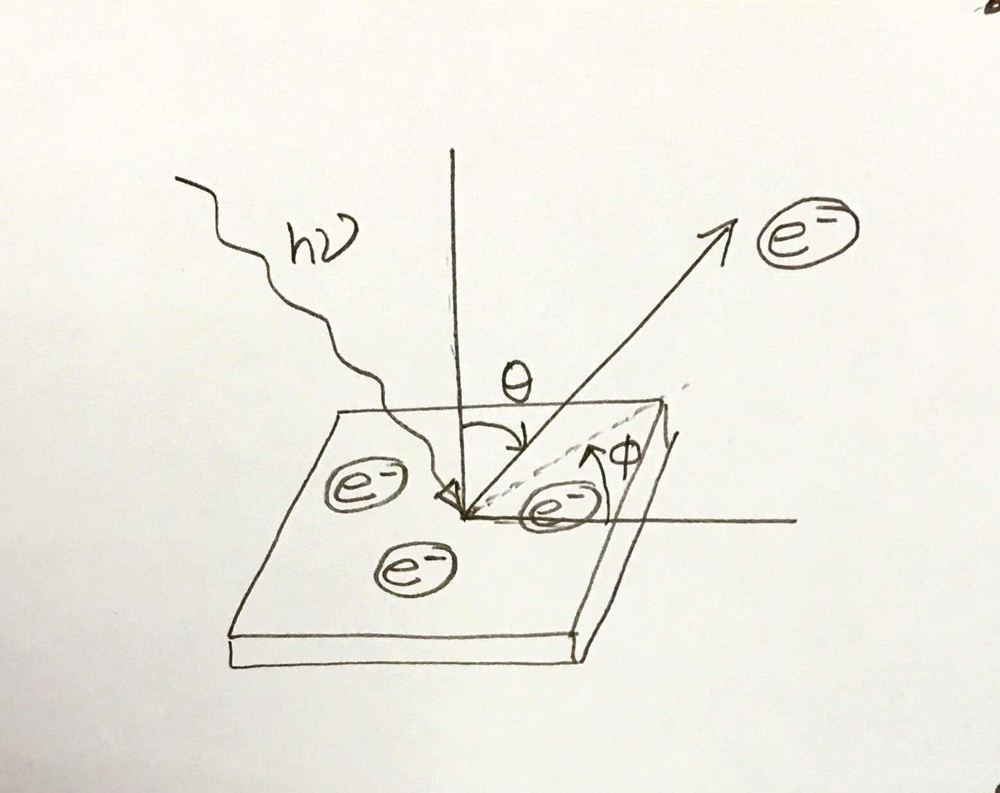

### Introduction: Angle Resolved Photoemission SPectroscopy 

The electronic band structure constitutes the macroscopic basis of most physical properties of a material. Whether a solid is insulating, semiconducting, metallic, or superconducting, or it is transparent, or shows a distinct color, is determined by the electronic structure of the solid. 

The classical properties, like thermal conductivity and heat capacity are determined by the electronic structure. A detailed understanding of the electronic structure through microscopic investigations, along with theoretical analysis, is necessary in understanding and development of new materials allowing for detailed control of the properties. The electronic states in a material is described by the electron energy, momentum and spin. 

#### Photoemission spectroscopy: 
Photoemission spectroscopy is the most powerful, and the only tool available to directly probe the electronic structure of a material. Photoemission spectroscopy is based on the principle of photo-electric effect, in which the sample under investigation is irradiated with a beam of photon. If the energy of the incident photon $(h\nu)$ is large enough for the electron to overcome its binding energy and the work function of the solid, an electron is emitted from the system, and can be detected by an electron spectrometer. The electron spectrometer determines the kinetic energy of this electron detected in a particular angle. The angular information is directly related to the momentum information. This is how we can learn about the electronic bands inside the material. 

 

Schematic of the photoemission process. The density of states of outgoing electrons is proportional to that of the material. This schematic is taken from the Hufner's book. 

Let us consider a material which has this electronic structure: it has two core levels, and valence band near the Fermi energy. Now, if we measure the intensity distribution of photo emitted electrons as a function of electron kinetic energy, we would see something like this. It is straight forward that the photoemission intensity is proportional the density of electronic states of the material, of course, the spectra is broadened due to the finite resolution of the experimental technique. 

What is angle resolved photoemission spectroscopy or more commonly abbreviated as ARPES? 

The basic principle of photoemission spectroscopy is based on the photoelectric effect. In the process of photoelectric effect, the energy of a photon is absorbed by an electron, if the incident photon has enough energy i.e., if the electron gains enough energy, the electron is emitted from the material to the vacuum. 

 

We collect the photo emitted electrons in an electron analyzer which determines the kinetic energy of the electrons and records in which angle the electrons are emitted from the surface. 

Before the photon is absorbed by the electron, it may travel a finite distance inside the material. After the photon is absorbed by the electron, the electron can travel in all direction, however we can detect only the electrons that are coming out of the surface. Also, the mean free path of electron inside a solid is very small. It depends on the kinetic energy of the electron. In UV range, the typical mean free path is of the order of few angstrom. That is why photoemission spectroscopy in the UV range is extremely surface sensitive. 

Now, the most important question is what information can we obtain about the material by analyzing the energy and angle of emission of the photo-emitted electrons. In every process, the total energy and momentum of a system is conserved. From the energy conservation we can determine the binding energy of the electronic state from where the electron is photo-excited. And from the momentum conservation, we can determine the momentum vector of the electronic state. Therefore, we can effectively map the bandstructure of a material by ARPES. 

This single particle assumption of the photoemission process is simplified. In a real material, the electrons are not independent free particles. They are subject to many body interaction. Therefore, interpreting the band structure from the observed photoemission spectra is not often trivial. We need better theoretical modelling and understanding of the system. 
