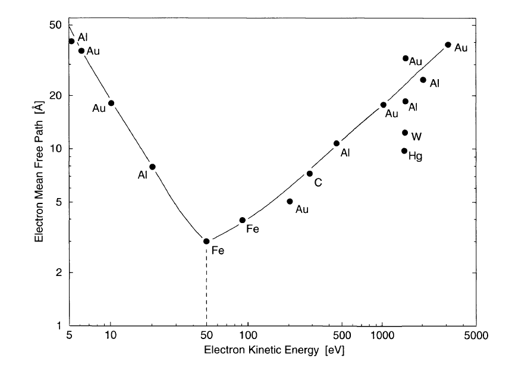

### Three-step model 

In this section we will discuss the basic principles for determining the electronic band structure by measuring the external parameters such as the kinetic energy of the photoemitted electrons, emission angle and spin. 

The most commonly used model for the interpretation of photoemission spectra in solids is the so-called three-step model. It breaks up the complicated photoemission process into three steps: the excitation of the photoelectron, its passage through the solid to the surface and its penetration through the surface into the vacuum, where it is detected. 

##### Photo-excitation:  
The probability of electronic transition from the initial state $\mid\psi_i>$ representing the occupied valence state or core level to a final state $\mid\psi_f>$ due to the absorption of the photon (of energy $h\nu$) can be derived from the first order perturbation theory. According to the Fermi's golden rule, this transition probability is given by: 

$$ W = \mid <\psi_f \mid \textbf{H}' \mid \psi_i>\mid ^2 \delta(E_f − E_i − h\nu)  $$ 

where $\textbf{H}'$ is the perturbation due to the photon. The $\delta$-function ensures the energy conservation. 

$$ E_{bin} + W_ϕ + E_{kin} = h\nu $$

The binding energy of the electron in the initial state can be mapped once the kinetic energy of the photo-emitted electron is known. 

The second conservation rule in the photo-excitation process is the momentum conservation. In the solid, the momentum conservation can be expressed as, 

$$  \textbf{k}_f = \textbf{k}_i \pm \textbf{G}  $$ 

$\textbf{G}$ is the reciprocal lattice vector, and $\textbf{k}_i$  and $\textbf{k}_f$  are the initial and final state wave vectors. 
 
The momentum corresponding to the incident photon is negligible for the photon energies within the soft x-ray region or lower. 

A free electron cannot satisfy both the energy and momentum conservation laws and thus, cannot absorb a photon. For a free electron the energy momentum relationship is a parabola. For a given initial state, there is no final state for the direct/vertical ($\textbf{k}$-conserved) transition. 

At a photon energy close to soft x-rays or lower, the contribution due to spin-flip transition is negligible $(<2\times10^{−2})$ compared to spin-conserved transition. 

Transport of the photo-excited electrons to the sample surface 
A direct relation between the energy and momentum of the electrons detected outside the crystal and those inside the crystal can be established only if the electrons do not loose energy on its way to the surface. Inelastically scattered electrons are practically lost for the band structure determination. 

The occurrence of a cascade of inelastic scattering processes produces a large number of low energy electrons. In the photoemission spectra, these so called secondary electrons give rise to a structureless background with a large peak at very low energies. 

 

Electron mean free path of the photoelectrons depend on its kinetic energy. Mean free path depends also on the material. The shortest mean free path is often found within the energy range of $40-100~eV$; this is an important energy range as the technique is most surface sensitive here. 

##### Transmission through the sample surface 
Refraction effects occur when the electrons passes through the sample surface due to the potential change arising from the symmetry breaking at the surface. The parallel component of the electron momentum is conserved in this process. 

$$ \textbf{k}_{\parallel}^{int} = \textbf{k}_{\parallel}^{ext} \pm \textbf{G} $$

Photoemission processes, where the addition of the reciprocal vector, that is not perpendicular to the sample surface, is involved, are called Umklapp process which gives rise to extra final state bands. Neglecting Umklapp process: 

$$ k_{\parallel}^{int} = \sqrt{(2m / \sin⁡(\theta)}  $$

Perpendicular component can be obtained as if one assumes the free-electron like final states which offset from the vacuum potential by the inner potential $V_0$. 

$$ k_{\perp}^{int} = \sqrt{(2m / \cos⁡(\theta)}  $$

$V_0$ can be estimated experimentally by locating the extremal points from the band dispersions. 
