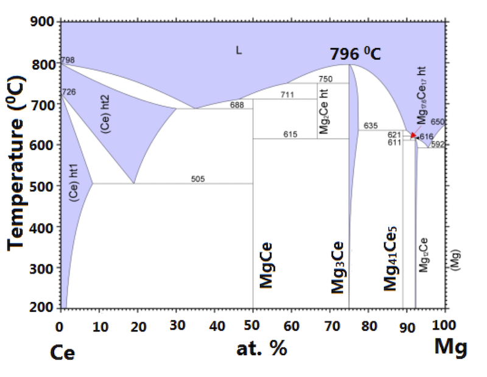

#### Bridgman method 

This is perhaps the most cleanest method of crystal growth. Here the single crystal is grown directly from it's molten form. 

One of the limitations of this method is that this method can be applied only to congruently melting compounds, meaning the phase in the molten form and in the solid form is the same. For this, we need to check the phase diagram of the compound. Here is a typical binary phase diagram. 

{:style="width:500px;"} 

We put the constituent elements in a alumina crucible. Because generally alumina does not react with other metals up to a very high temperature of 1800$~^{\circ}C$. It is preferable to have a sharp tip alumina crucible, in order to allow a single nucleation of crystal. 

Then we need to seal the crucible inside a protective tube. We can use quartz tube up to 1200$~^{\circ}C$. We need to seal our crucible (with elements inside) in vacuum or in presence of inert gas. So that at elevated temperature our constituent element, or the product compound do not get oxidized. 

Later we need a furnace with a temperature gradient. We heat the furnace to a temperature more than the melting temperature of the elements. At that temperature the compound is formed which is in molten form. We keep the melt at that temperature sufficient time (1 day) chemical reaction to complete. 

We start cooling the melt very slowly, say, at a rate of 1$~^{\circ}C/hour$ so that we allow enough time for crystallization. Here we try to use some sort of temperature gradient so that the crystallization starts at the tip of the pointed/sharp tip crucible. It promotes a single nucleation and grow it in a bigger single crystal. 

Once the temperature of the melt becomes less than the melting point of the compound, i.e., all the melt becomes solid, we can switch off the furnace in order to quickly cool down to room temperature. 
