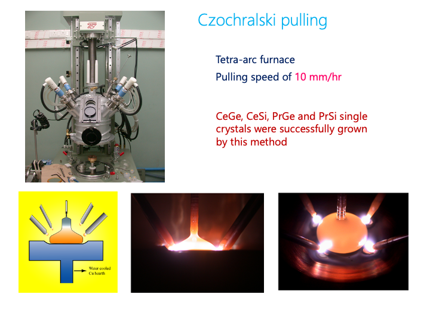

#### Czochralski method 

This method was named after Prof. Jan Czochralski. One day he was writing. At that time people used to have ink pens, one dips the feather in the ink and write in the paper. By mistake instead of dipping his feather in the ink, he dipped it in the molten tin (Sn), and as he quickly withdraw his feather, it made a wire of tin. Later he found that this wire was a single crystal of tin. 

This method is modified over times. But the basic principle is the same: we melt the elements in a protective environment. Then insert a seed rod, which could be a single crystal of the same material. But for growing the crystal for the first time, the single crystal seed is not available. We can use a tungsten crystal as seed, which should not react with the molten compound. 

Next the seed rod is pulled very slowly, say at a rate of 10$~mm/hr$. As the rod comes out of the melt, the top of the melt is cold. Like Bridgman method, there is a temperature gradient. The melt starts to solidify. We pull it slowly in order to give enough time for crystallization. 

This is how it is done in the lab. Here the compounds are being melted in a tetra-arc furnace: 

