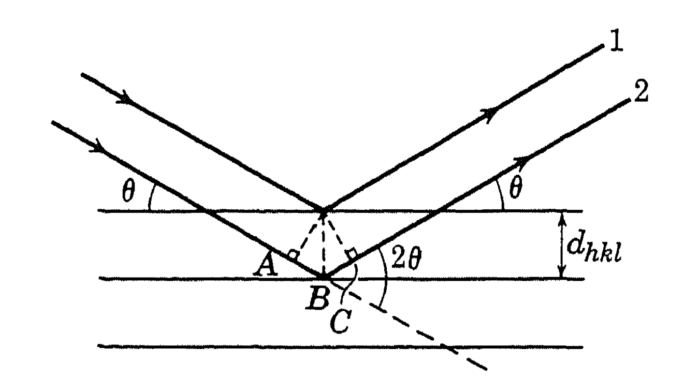

#### Miller indices and Bragg's diffraction

**Miller indices:** the lattice points forming a space-lattice may be thought of as occupying various sets of parallel planes. In order to specify the orientation of a set of planes, Miller indices are used. Suppose a particular plane of given set has intercepts $p\textbf{a}$, $q\textbf{b}$, and $r\textbf{c}$ with the crystal axes, where $\textbf{a}$, $\textbf{b}$ and $\textbf{c}$ are the lattice constants. The Miller indices of the set of planes are then given by three numbers $h$, $k$, $l$ such that 

$$ h : k : l = \frac{1}{p}  : \frac{1}{q}  : \frac{1}{r}  $$   

with the condition that $h$, $k$, and $l$ are the smallest integers satisfying above equation. Remember that these set of indices refer to a set of parallel planes, not a specific plane. The plane is represented by $(hkl)$ while the direction is represented by $[hkl]$. 

The distance between successive $(hkl)$ planes can be calculated. In case cubic system, 

$$ d_{hkl} = \frac{a}{\sqrt{(h^2 + k^2 + l^2)}} $$ 

**Bragg's x-ray diffraction:**  
  

Bragg considered x-ray diffraction from a crystal as a problem of reflection from atomic planes. Consider a set of parallel atomic planes of Miller indices $(hkl)$, the distance between successive planes being $d_{hkl}$. From the above figure, we see that rays 1 and 2 can reinforce (interfere constructively) each other in the reflected direction only if their path differences is an integer times wavelength of x-ray $\lambda$. Thus the condition for reflection from the set of planes under consideration: 

$$ 2 d_{hkl} \sin(\theta) = n \lambda  $$ 

with $n = 0, 1, 2, 3, ...$
