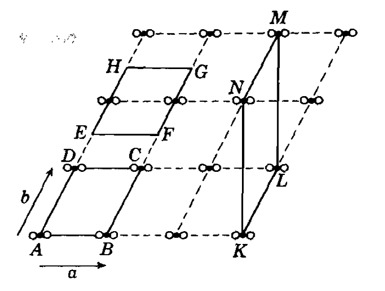
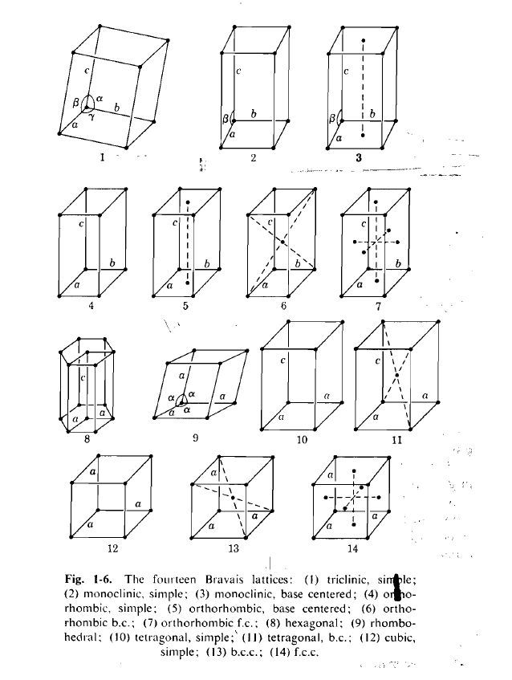
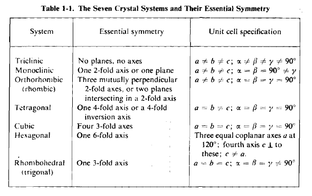

#### Bravais Lattice 

In this section, we will introduce a number of definitions. 

Lattice is the mathematical representation of a crystal. In order to describe the structure of a crystal mathematically, we use the concept of lattice. The lattice is an abstract two dimensional net or three dimensional mesh, and when you attach a basis (which could be a simple atom, or more complex: a group of atoms) to every lattice point, it becomes a real crystal. 

$$ Lattice + Basis = Crystal~structure $$ 

**Lattice translational vector:**  
A crystal is made up by repeated translation of the basis. Therefore, a lattice consists of all points with position vectors $\textbf{R}$ of the form: 

$$ \textbf{R} = n_1\textbf{a}_1 + n_2\textbf{a}_2 + n_3\textbf{a}_3 $$

Where $\textbf{a}_1$, $\textbf{a}_2$, and $\textbf{a}_3$ are any three vectors not all in the same plane, and $n_1$, $n_2$, and $n_3$ range through all integral values. The vectors $\textbf{a}_1$, $\textbf{a}_2$, and $\textbf{a}_3$ are called primitive vectors, and are said to span the lattice. 

**Unit cell and Bravais lattices:**  
A volume of space that, when translated through all the vectors in a Bravais lattice, just fills all of space without either overlapping itself or leaving voids is called a primitive cell or primitive unit cell of the lattice. 

There is no unique way of choosing a primitive cell for a given Bravais lattice. It is usually convenient to choose as a unit cell with the shortest possible sides. 

Here we will consider a two dimensional example: 

{:style="width:400px;"}  

The choice of unit cell ABCD, EFGH or KLMN are all valid as all of them spans the whole crystal. However, the choice of ABCD is probably more convenient. 

There are a total of 14 different Bravais lattice types.  
{:style="width:600px;"}  

There are seven unique crystal system:  
{:style="width:600px;"}  

**Packing fraction:**  
Fraction of space filled by the touching spheres at each lattice points. 
